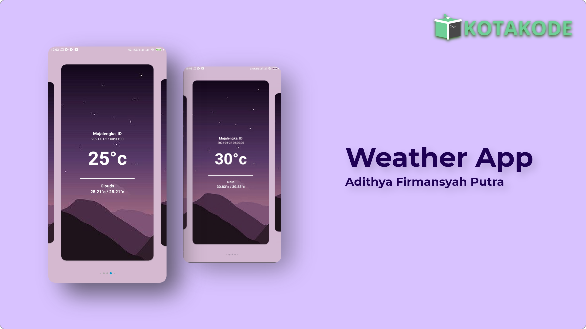

<h1 align="center">
  Kotakode's Blog Series : Weather App
</h1>
<p align="center">
  Weather App : Blog Series in Kotakode.
</p>
<p align="center">
  <a href="http://developer.android.com/index.html"></a>
  <a href="http://kotlinlang.org"></a>
  <a href="https://developer.android.com/studio/releases/gradle-plugin"></a>
  <a href="https://github.com/Adithya-13/WeatherAppKotakode/"></a>
</p>

<p align="center">
  
</p>

## Table of Contents
- [Introduction](#introduction)
- [Installation](#installation)
- [Demo](#demo)

## Introduction

This project is made for Kotakode's Blog Series in here 

* [Part 1 - Pengenalan API](https://kotakode.com/blogs/4686/Part-1---Pengenalan-API)
* [Part 2 - Macam - macam HTTP Client pada Android](https://kotakode.com/blogs/4691/Part-2---Macam-macam-HTTP-Client-pada-Android)
* [Part 3 - Membuat Layout yang Menarik pada Aplikasi Android](https://kotakode.com/blogs/5030/Part-3---Membuat-Layout-yang-Menarik-pada-Aplikasi-Android-(Weather-App))
* [Part 4 - Open Weather Map API](https://kotakode.com/blogs/5058/Part-4---OpenWeatherMap-API-(Weather-App))
* [Part 5 - Request API dengan Retrofit](https://kotakode.com/blogs/5119/Part-5---Request-API-dengan-Retrofit-(Weather-App))
* [Part 6 - Menghubungkan Data dengan Layout](https://kotakode.com/blogs/5125/Part-6---Menghubungkan-Data-dengan-Layout-(Weather-App))

I Hope this project is help people for who need to learn somethings in Android Development.

## Installation

Clone or Download and Open it into Android Studio
```
    https://github.com/Adithya-13/WeatherAppKotakode.git
```  

## Demo


